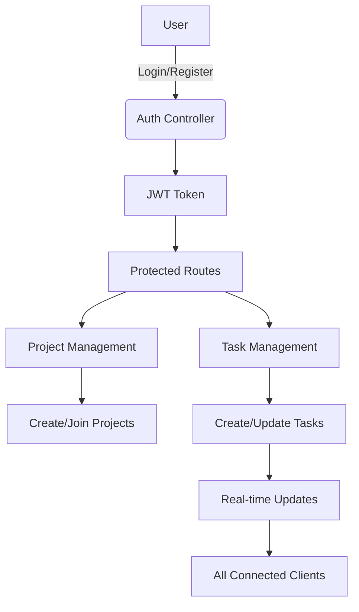

# Collaborative Project Tracker - Full Stack Application

## 📝 Introduction

A full-stack project management application that enables teams to collaborate on projects, manage tasks, and track progress in real-time. Built with React, Node.js, Express, and MongoDB.


## ✨ Features

- **User Authentication** (Register/Login with JWT)
- **Project Management** (Create, Join, Update projects)
- **Task Tracking** (Kanban-style board with drag & drop)
- **Real-time Updates** (WebSocket integration)
- **Role-based Permissions** (Owner vs Member)
- **Responsive Design** (Works on mobile & desktop)

## 🛠️ Tech Stack

**Frontend:**
- React 18
- React Router 6
- Tailwind CSS
- React Beautiful DnD
- Socket.io Client

**Backend:**
- Node.js
- Express
- MongoDB (Atlas)
- Mongoose
- Socket.io
- JWT Authentication

## 📂 Folder Structure

```
project-tracker/
├── backend/
│   ├── config/          # DB and environment configs
│   ├── controllers/     # Route controllers
│   ├── middleware/      # Auth and error middleware
│   ├── models/          # MongoDB models
│   ├── routes/          # API routes
│   ├── services/        # Business logic
│   ├── utils/           # Helper functions
│   ├── app.js           # Express app setup
│   └── server.js        # Server entry point
│
├── frontend/
│   ├── public/          # Static assets
│   ├── src/
│   │   ├── api/         # API service layer
│   │   ├── components/  # Reusable components
│   │   ├── context/     # React contexts
│   │   ├── hooks/       # Custom hooks
│   │   ├── pages/       # Route components
│   │   ├── styles/      # Global styles
│   │   ├── App.jsx      # Main app component
│   │   └── main.jsx     # React entry point
│   └── package.json
│
├── .env.example         # Environment variables template
└── README.md            # This file
```

## 🚀 Setup & Installation

### Prerequisites
- Node.js (v16+)
- MongoDB Atlas account
- Git

### Backend Setup
1. Navigate to backend folder:
   ```bash
   cd backend
   ```
2. Install dependencies:
   ```bash
   npm install
   ```
3. Create `.env` file from example:
   ```bash
   cp .env.example .env
   ```
4. Update `.env` with your MongoDB URI and JWT secret

### Frontend Setup
1. Navigate to frontend folder:
   ```bash
   cd frontend
   ```
2. Install dependencies:
   ```bash
   npm install
   ```
3. Create `.env` file:
   ```bash
   cp .env.example .env
   ```
4. Set your backend API URL in `.env`

## 🏃‍♂️ Running the Application

### Backend
```bash
cd backend
npm run dev
```

### Frontend
```bash
cd frontend
npm run dev
```

The application will be available at `http://localhost:5173`

## 🔌 API Documentation

View the complete API documentation:
- [Postman Collection](/docs/api.postman_collection.json)
- [Swagger UI](http://localhost:5000/api-docs) (when running locally)

## 📊 Flow Chart



## 🧪 Testing

Run backend tests:
```bash
cd backend
npm test
```

## 🌐 Deployment

### Backend (Render/Heroku)
1. Set environment variables
2. Configure build command: `npm install && npm run build`
3. Set start command: `node server.js`

### Frontend (Vercel/Netlify)
1. Set environment variables
2. Configure build command: `npm install && npm run build`
3. Set publish directory: `dist`

## 🤝 Contributing

1. Fork the repository
2. Create your feature branch (`git checkout -b feature/AmazingFeature`)
3. Commit your changes (`git commit -m 'Add some AmazingFeature'`)
4. Push to the branch (`git push origin feature/AmazingFeature`)
5. Open a Pull Request

## 📜 License

Distributed under the MIT License. See `LICENSE` for more information.

## ✉️ Contact

Author: [Your Name]  
Email: your.email@example.com  
Project Link: [https://github.com/yourusername/project-tracker](https://github.com/yourusername/project-tracker)

## 🙏 Acknowledgments

- [React Documentation](https://reactjs.org/docs/getting-started.html)
- [Tailwind CSS](https://tailwindcss.com/docs)
- [Mongoose Documentation](https://mongoosejs.com/docs/guide.html)

---

⭐️ Feel free to star the repository if you find this project useful!  
🔁 Visit us again for future updates and improvements.